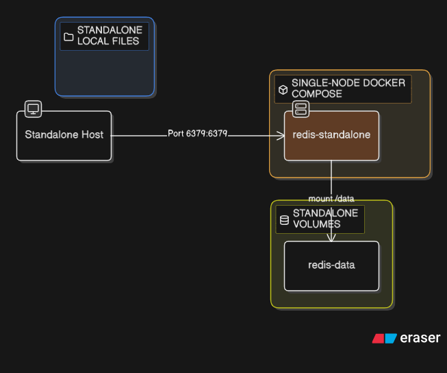
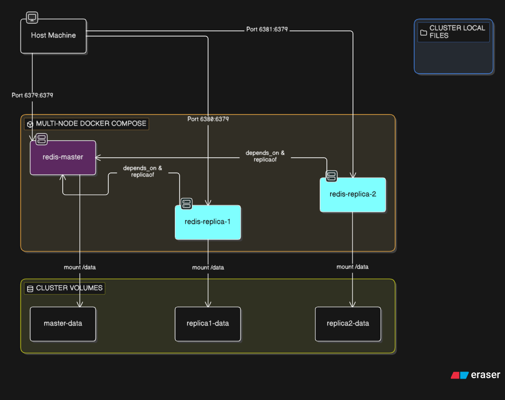

# Build Your Own Redis (in Go)

This repository contains a fully functional, Redis-compatible in-memory data structure store built from scratch in Go. It was developed following the **[CodeCrafters "Build Your Own Redis" challenge](https://codecrafters.io)**, which provides an excellent hands-on approach to understanding the internal mechanics of networked services, distributed systems, and databases.

## 🚀 Features Implemented

This project supports a wide array of standard Redis commands and concepts, handling raw TCP connections and parsing the RESP (REdis Serialization Protocol) directly.

* **Core Data Structures & Commands:**
   * Strings: `SET` (with `EX`/`PX` TTLs), `GET`, `INCR`, `TYPE`, `ECHO`, `PING`.
   * Lists: `LPUSH`, `RPUSH`, `LRANGE`, `LLEN`, `LPOP`, `RPOP`, and blocking operations (`BLPOP`).
   * Sorted Sets: `ZADD`, `ZRANGE`, `ZRANK`, `ZCARD`, `ZSCORE`, `ZREM`.

* **Replication (Master/Replica):**
   * Full handshake sequence (`PING`, `REPLCONF`, `PSYNC`).
   * Initial synchronization via empty RDB file transfer.
   * Asynchronous command propagation from Master to Replicas.
   * Replication offset tracking and acknowledgment (`REPLCONF GETACK`).
   * Synchronous replication synchronization via the `WAIT` command.

* **Persistence:**
   * **RDB (Redis Database):** Parsing binary `.rdb` snapshot files to load initial state and expiries.
   * **AOF (Append-Only File):** Command logging and sequential replaying on startup with manifest file tracking.

* **Transactions (Optimistic Locking):**
   * Support for `MULTI`, `EXEC`, and `DISCARD` block queues.
   * `WATCH` command to monitor keys for modifications, aborting transactions if changes occur (CAS - Compare and Swap logic).

* **Streams:**
   * `XADD` (with auto-generating IDs `*`), `XRANGE`, and `XREAD` (with blocking support `BLOCK` and dynamic ID resolution `$`).

* **Geospatial (GEO):**
   * Geohash encoding/decoding using bit interleaving.
   * Haversine formula for distance calculation.
   * `GEOADD`, `GEOPOS`, `GEODIST`, and `GEOSEARCH` (by radius).

* **Pub/Sub:**
   * `SUBSCRIBE` and `PUBLISH` using observer patterns.

* **Authentication & ACL:**
   * `requirepass` configuration support.
   * `AUTH` command for connection unlocking.
   * Basic `ACL SETUSER` and `ACL GETUSER` returning SHA-256 hashed passwords.

---

## 🧠 DSA Exploration: Current State vs. Production Redis

Building Redis is an excellent exercise in Data Structures and Algorithms. Here is a comparison of how features are implemented in this repository versus how a production-grade Redis does it. **This is a great roadmap for further DSA exploration.**

### 1. The Key-Value Store (Dictionaries)

* **Current:** Uses Go's native `map[string]any` guarded by a `sync.RWMutex`.

* **Redis Internals:** Uses custom hash tables that implement **incremental resizing**. When the map gets full, Redis creates a new table and gradually moves buckets over during normal command execution to avoid blocking the main thread.

### 2. Sorted Sets (ZSET)

* **Current:** Backed by a Go `map[string]float64`. Range queries (`ZRANGE`) extract all nodes and use Go's `sort.Slice` ($O(N \log N)$ time complexity).

* **Redis Internals:** Uses a combination of a Hash Map (for $O(1)$ member lookups) and a **Skip List** (a probabilistic linked list). A Skip List allows for $O(\log N)$ insertions, deletions, and range queries. *Building a Skip List from scratch is a fantastic follow-up DSA project.*

### 3. Streams

* **Current:** Implemented as a flat Go slice (`[]StreamEntry`). Fetching the last ID is $O(1)$, but searching requires linear scanning.

* **Redis Internals:** Uses a **Radix Tree (Trie)** where each node contains a "listpack" (a tightly packed array of data). This minimizes memory overhead significantly and makes looking up specific IDs incredibly fast.

### 4. Geospatial Data

* **Current:** Converts coordinates to a 52-bit integer via bit interleaving (Geohashing) and stores them inside the Sorted Set map.

* **Redis Internals:** Does exactly this! Redis `GEO` commands are fundamentally just `ZSET` commands under the hood. The 52-bit geohash becomes the `score`. Because Geohashes preserve spatial locality (points close to each other have similar integer prefixes), Redis can do radius searches by querying integer ranges in the underlying Skip List.

### 5. Key Expiration (TTL)

* **Current:** Uses lazy evaluation (checking if expired when `GET` is called) combined with an active Goroutine that sleeps and cleans up.

* **Redis Internals:** Also uses lazy evaluation. However, instead of spawning a thread per key, Redis periodically samples a random batch of keys with TTLs. If a high percentage of the batch is expired, it aggressively samples again (Probabilistic Active Expiration).

---

## 🔭 Future Scope & Improvements

If you're looking to expand this project further, consider implementing:

1. **Skip Lists for ZSETs:** Refactor the current `map` + `sort` implementation into a proper Skip List to achieve true $O(\log N)$ performance for `ZRANGE`.
2. **RDB Serialization:** Currently, the server *parses* RDB files. You could implement the reverse: dumping the in-memory state back into a properly formatted binary `.rdb` file.

3. **Eviction Policies:** Implement memory limits (`maxmemory`) and algorithms like **LRU** (Least Recently Used) or **LFU** (Least Frequently Used) to evict keys when the cache is full.
4. **RESP3 Support:** Upgrade the RESP parser to support Redis 6+ RESP3 features (maps, sets, booleans, floating-point numbers).
5. **Cluster Mode / Sentinels:** Add support for highly available setups involving auto-failover, cluster routing (`MOVED` responses), and hash slots.

## 🎯 Architecture

### Single / Master Node architecture

### Multi Node / Master-slave architecture

